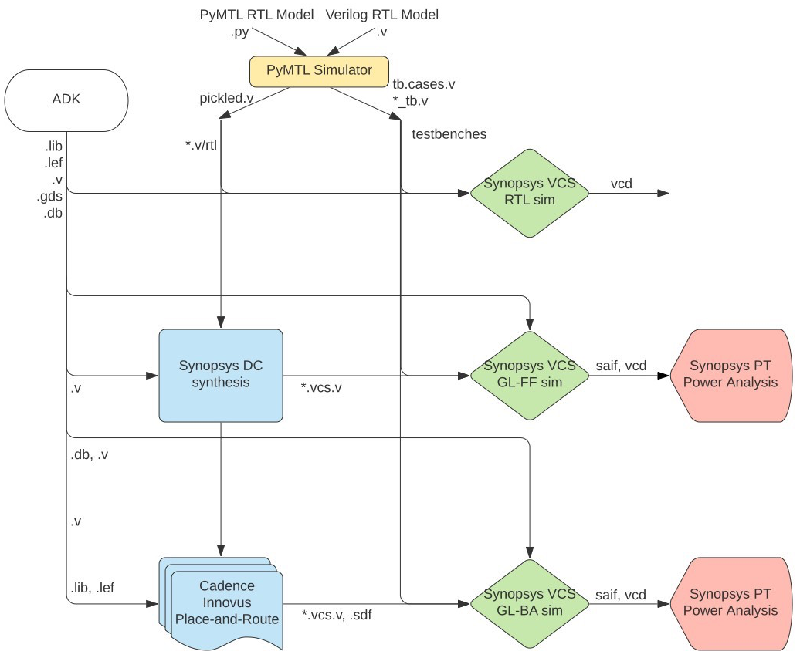

ECE 5745 Section 3: ASIC Automated Flow
==========================================================================

 - Author: Jack Brzozowski, Christopher Batten
 - Date: February 10, 2022

**Table of Contents**

 - Introduction
 - Test, Simulate, and Translate the Design
 - Generating an ASIC Flow
 - Pushing the Design through the Automated ASIC Flow
 - Evaluating Cycle Time
 - Evaluating Area
 - Evaluating Energy
 - Summary

Introduction
--------------------------------------------------------------------------

In the previous sections, we learned how to manually run most of the
tools we will be using in the course. These tools are shown below.

Obviously, entering commands manually for each tool is very tedious and
error prone. An agile hardware design flow demands automation to simplify
rapidly exploring the cycle time, area, and energy design space of one or
more designs. Luckily, Synopsys and Cadence tools can be easily scripted
using TCL, and even better, the ECE 5745 staff have already created these
TCL scripts along with a set of Makefiles to run the TCL scripts using a
framework called mflowgen. In this section, we will learn how to use this
automated flow to evaluate cycle time, area, and energy of a specific
design.

The first step is to start MobaXterm and then `ssh` into `ecelinux`. Once
you are at the `ecelinux` prompt, source the setup script, clone this
repository from GitHub, and define an environment variable to keep track
of the top directory for the project.

    % source setup-ece5745.sh
    % mkdir -p $HOME/ece5745
    % cd $HOME/ece5745
    % git clone https://github.com/cornell-ece5745/ece5745-S03-asic-flow
    % cd ece5745-S03-asic-flow
    % TOPDIR=$PWD

Test, Evaluate, and Translate the Design
--------------------------------------------------------------------------

As in the previous sections, we will be using the following four-stage
registered incrementer as our example design:

Before we can use the automated flow, we must make sure our design passes
all of our tests. There is no sense in running the flow if the design is
incorrect!

    % mkdir -p $TOPDIR/sim/build
    % cd $TOPDIR/sim/build
    % pytest ../regincr

Next we should rerun all the tests with the `--test-verilog` and
`--dump-vtb` command line options to ensure that the design also works
after translated into Verilog and that we generate a Verilog test-bench
for gate-level simulation. You should do this step even if you are using
Verilog for your RTL design.

    % cd $TOPDIR/sim/build
    % pytest ../regincr --test-verilog --dump-vtb

The tests are for verification. We probably also want to do some
preliminary design-space exploration of execution time in cycles using an
evaluation simulator. You can run the evaluation simulator for our
four-stage registered incrementer like this:

    % cd $TOPDIR/sim/build
    % ../regincr/regincr-sim random
    % ../regincr/regincr-sim zeros
    % less RegIncr4stageRTL__pickled.v
    % less RegIncr4stageRTL_random_tb.v.cases
    % less RegIncr4stageRTL_zeros_tb.v.cases

You should now have the Verilog that we want to push through the ASIC
flow along with two Verilog test benches that can be used for power
analysis. The first test bench uses a stream of 100 inputs where each
input is random, and the second test bench uses a stream of 100 inputs
where where each input is zero.

Generating an ASIC Flow
--------------------------------------------------------------------------

In agile ASIC design, we usually prefer building _chip generators_
instead of _chip instances_ to enable rapidly exploring a design space of
possibilitise. Similarly, we usually prefer using a _flow generator_
instead of a _flow instance_ so we can rapidly generate many different
flows for different designs, parameters, and even ADKs. We will use
the mflowgen framework as our flow generator. You can read more about
mflowgen here:

  - <https://mflowgen.readthedocs.io/en/latest>

We use a `flow.py` file to configure the flow. Every design you want to
push through the flow should have its own unique subdirectory in the
`asic` directory with its own `flow.py`. Let's take a look at the
`flow.py` for the four-stage registered incrementer here:

    % cd $TOPDIR/asic
    % less regincr-4stage/flow.py

There is quite a bit of information in the `flow.py`, but the important
configuration information is placed at the top:

    #-----------------------------------------------------------------------
    # Parameters
    #-----------------------------------------------------------------------

    adk_name = 'freepdk-45nm'
    adk_view = 'stdview'

    parameters = {
      'construct_path'  : __file__,
      'sim_path'        : "{}/../../sim".format(this_dir),
      'design_path'     : "{}/../../sim/regincr".format(this_dir),
      'design_name'     : 'RegIncr4stageRTL',
      'clock_period'    : 1.0,
      'clk_port'        : 'clk',
      'reset_port'      : 'reset',
      'adk'             : adk_name,
      'adk_view'        : adk_view,
      'pad_ring'        : False,

      # Gather
      'test_filter'     : 'RegIncrNstageRTL',

      # VCS-sim
      'test_design_name': 'RegIncr4stageRTL',
      'input_delay'     : 0.05,
      'output_delay'    : 0.05,

      # Synthesis
      'gate_clock'      : False,
      'topographical'   : False,

      # Hold Fixing
      'hold_slack'      : 0.070,
      'setup_slack'     : 0.035,

      # PT Power
      'saif_instance'   : 'RegIncr4stageRTL_tb/DUT',
    }

The `adk_name` specifies the targeted technology node and fabrication
process. The `design_path` points to where all of the source files are
and the `design_name` is the name of the corresponding top-level module.
The `clock_period` is the target clock period we want to use for
synthesis and place-and-route. Further down in the `flow.py` you can find
all of the steps along with how those steps are connected together to
create the complete flow.

To get started create a build directory and run mflowgen. Every push
through the ASIC flow should be in its own unique build directory. You
need to explicitly specify which design you want to push through the flow
when you run mflowgen.

    % mkdir -p $TOPDIR/asic/build
    % cd $TOPDIR/asic/build
    % cd build
    % mflowgen run --design ../regincr-4stage
    % make list

The `list` Makefile target will display the various steps in the flow.
The Makefile will take care of running the steps in the right order. You
can use the `graph` Makefile target to generate a figure of the overall
ASIC flow.

    % cd $TOPDIR/asic/build
    % make graph

You can open the generated `graph.pdf` file to see the figure which is a
much more detailed version of the high-level flow graph shown above. You
can use the `status` Makefile target to see which steps have been
completed.

Pushing the Design through the Automated ASIC Flow
--------------------------------------------------------------------------

We want to use the generated flow to complete all of the steps from the
previous discussion sections:

 - run all of the tests to generate appropriate Verilog test harnesses
 - run all of the tests using 4-stage RTL simulation
 - perform synthesis (the front-end of the flow)
 - run all of the test using fast-functional gate-level simulation
 - perform place-and-route (the back-end of the flow)
 - run all of the tests using back-annotated gate-level simulation

Here are the corresponding commands. Each Makefile target corresponds to
one of the above steps.

    % cd $TOPDIR/asic/build
    % make ece5745-block-gather
    % make brg-rtl-4-state-vcssim
    % make brg-synopsys-dc-synthesis
    % make post-synth-gate-level-simulation
    % make brg-cadence-innovus-signoff
    % make post-pnr-gate-level-simulation

Instead of typing the complete step name, you can also just use the step
number shown when you use the `list` Makefile target. Go ahead and work
through each step one at a time and monitor the output. You can also use
the `status` and `runtimes` Makefile targets to see the status of each
step and how long each step has taken.

    % cd $TOPDIR/asic/build
    % make status
    % make runtimes

Make sure the design passes four-state RTL simulation, fast-functional
gate-level simulation, and back-annotated gate-level simulation! Keep in
mind it can take 5-10 minutes to push simple designs completely through
the flow and up to an hour to push more complicated designs through the
flow. Consider using just the ASIC flow front-end to ensure your design
is synthesizable and to gain some rough early intuition on area and
timing. Then you can iterate quickly and eventually focus on the ASIC
flow back-end.

We can now open up Cadence Innovus to take a look at our final design.

    % cd $TOPDIR/asic/build/10-brg-cadence-innovus-signoff
    % innovus -64 -nolog
    innovus> source checkpoints/design.checkpoint/save.enc

The power ring seems so large because the design is so small. You can use
the design browser to help visualize how modules are mapped across the
chip. Here are the steps:

 - Choose _Windows > Workspaces > Design Browser + Physical_ from the menu
 - Hide all of the metal layers by pressing the number keys
 - Browse the design hierarchy using the panel on the left
 - Right click on a module, click _Highlight_, select a color

You can use the following steps in Cadence Innovus to display where the
critical path is on the actual chip.

 - Choose _Timing > Debug Timing_ from the menu
 - Right click on first path in the _Path List_
 - Choose _Highlight > Only This Path > Color_

You can create a screen capture to create an amoeba plot of your chip
using the _Tools > Screen Capture > Write to GIF File_. We recommend
inverting the colors so your amoeba plot looks better in a report.

Evaluating Cycle Time
--------------------------------------------------------------------------

When first pushing a design through the flow, you should check to see if
your design meets timing after synthesis. If it doesn't meet timing after
synthesis it likely won't meet timing after place-and-route! It is always
a good idea to start with a very conservative cycle time constraint and
then gradually push the tools harder.

You can look in the reports from synthesis and place-and-route to see if
the design met timing. Start by looking at the QOR report from synthesis:

    % cd $TOPDIR/asic/build
    % less 4-brg-synopsys-dc-synthesis/reports/RegIncr4stageRTL.mapped.qor.rpt

You will see several timing groups where timing groups correspond to
paths from input ports to registers, from registers to output ports, and
from registers to registers within the design.

    Timing Path Group 'REGIN'
    -----------------------------------
    Levels of Logic:               2.00
    Critical Path Length:          0.12
    Critical Path Slack:           0.80
    Critical Path Clk Period:      1.00
    Total Negative Slack:          0.00
    No. of Violating Paths:        0.00
    Worst Hold Violation:          0.00
    Total Hold Violation:          0.00
    No. of Hold Violations:        0.00
    -----------------------------------

    Timing Path Group 'REGOUT'
    -----------------------------------
    Levels of Logic:               7.00
    Critical Path Length:          0.58
    Critical Path Slack:           0.37
    Critical Path Clk Period:      1.00
    Total Negative Slack:          0.00
    No. of Violating Paths:        0.00
    Worst Hold Violation:          0.00
    Total Hold Violation:          0.00
    No. of Hold Violations:        0.00
    -----------------------------------

    Timing Path Group 'ideal_clock'
    -----------------------------------
    Levels of Logic:               8.00
    Critical Path Length:          0.55
    Critical Path Slack:           0.42
    Critical Path Clk Period:      1.00
    Total Negative Slack:          0.00
    No. of Violating Paths:        0.00
    Worst Hold Violation:          0.00
    Total Hold Violation:          0.00
    No. of Hold Violations:        0.00
    -----------------------------------

Figure out which timing path group has the worst slack. Here we can see
that there are no setup time violations across all three path groups
(that is good!) and that the REGOUT path group has the worst slack (i.e.,
the longest critical path). Now we can look at the critical path in the
timing report.

    % cd $TOPDIR/asic/build
    % less 4-brg-synopsys-dc-synthesis/reports/RegIncr4stageRTL.mapped.timing.setup.rpt

You might need to search through the timing report to find the path group
with the critical path. So we can search for the REGOUT path group, and
we find the following critical path:

    Point                                       Fanout       Cap     Trans      Incr       Path      Attributes
    -------------------------------------------------------------------------------------------------------------------
    clock ideal_clock (rise edge)                                             0.0000     0.0000
    clock network delay (ideal)                                               0.0000     0.0000
    reg_incrs__3/reg_out_reg_0_/CK (DFF_X1)                         0.0000    0.0000     0.0000 r
    reg_incrs__3/reg_out_reg_0_/Q (DFF_X1)                          0.0161    0.0933     0.0933 r
    reg_incrs__3/reg_out[0] (net)                 2       5.5849              0.0000     0.0933 r
    reg_incrs__3/add_x_1/A[0] (RegIncr4stageRTL_RegIncrRTL_0_DW01_inc_J1_0_1) 0.0000     0.0933 r
    reg_incrs__3/add_x_1/A[0] (net)                       5.5849              0.0000     0.0933 r
    reg_incrs__3/add_x_1/U13/A (HA_X1)                              0.0161    0.0249     0.1182 r
    reg_incrs__3/add_x_1/U13/CO (HA_X1)                             0.0121    0.0375     0.1557 r
    reg_incrs__3/add_x_1/n28 (net)                1       3.4956              0.0000     0.1557 r
    reg_incrs__3/add_x_1/U14/A (HA_X1)                              0.0121    0.0218     0.1775 r
    reg_incrs__3/add_x_1/U14/CO (HA_X1)                             0.0121    0.0359     0.2134 r
    reg_incrs__3/add_x_1/n29 (net)                1       3.4956              0.0000     0.2134 r
    reg_incrs__3/add_x_1/U15/A (HA_X1)                              0.0121    0.0218     0.2352 r
    reg_incrs__3/add_x_1/U15/CO (HA_X1)                             0.0121    0.0359     0.2712 r
    reg_incrs__3/add_x_1/n30 (net)                1       3.4956              0.0000     0.2712 r
    reg_incrs__3/add_x_1/U16/A (HA_X1)                              0.0121    0.0218     0.2930 r
    reg_incrs__3/add_x_1/U16/CO (HA_X1)                             0.0121    0.0359     0.3289 r
    reg_incrs__3/add_x_1/n31 (net)                1       3.4956              0.0000     0.3289 r
    reg_incrs__3/add_x_1/U17/A (HA_X1)                              0.0121    0.0218     0.3507 r
    reg_incrs__3/add_x_1/U17/CO (HA_X1)                             0.0121    0.0359     0.3866 r
    reg_incrs__3/add_x_1/n32 (net)                1       3.4956              0.0000     0.3866 r
    reg_incrs__3/add_x_1/U18/A (HA_X1)                              0.0121    0.0218     0.4084 r
    reg_incrs__3/add_x_1/U18/CO (HA_X1)                             0.0101    0.0333     0.4417 r
    reg_incrs__3/add_x_1/n27 (net)                1       2.5419              0.0000     0.4417 r
    reg_incrs__3/add_x_1/U12/A (XOR2_X1)                            0.0101    0.0159     0.4575 r
    reg_incrs__3/add_x_1/U12/Z (XOR2_X1)                            0.0478    0.0746     0.5321 r
    reg_incrs__3/add_x_1/SUM[7] (net)             1       7.3097              0.0000     0.5321 r
    reg_incrs__3/add_x_1/SUM[7] (RegIncr4stageRTL_RegIncrRTL_0_DW01_inc_J1_0_1)0.0000    0.5321 r
    reg_incrs__3/out[7] (net)                             7.3097              0.0000     0.5321 r
    reg_incrs__3/out[7] (RegIncr4stageRTL_RegIncrRTL_1)                       0.0000     0.5321 r
    out[7] (net)                                          7.3097              0.0000     0.5321 r
    out[7] (out)                                                    0.0478    0.0456     0.5777 r
    data arrival time                                                                    0.5777

    clock ideal_clock (rise edge)                                             1.0000     1.0000
    clock network delay (ideal)                                               0.0000     1.0000
    output external delay                                                    -0.0500     0.9500
    data required time                                                                   0.9500
    -------------------------------------------------------------------------------------------------------------------
    data required time                                                                   0.9500
    data arrival time                                                                   -0.5777
    -------------------------------------------------------------------------------------------------------------------
    slack (MET)                                                                          0.3723

The critical path is from the final pipeline register through the adder
carry chain and to the output port. We have 373ps of positive slack. Just
because we meet timing after synthesis does not mean we will meet timing
after place-and-route, so let's check that as well.

    % cd $TOPDIR/asic/build
    % less 10-brg-cadence-innovus-signoff/reports/timing.rpt

The format is different from the synthesis report, but it contains the
same kind of information. The report shows the critical path through the
design.

    Path 1: MET Late External Delay Assertion
    Endpoint:   out[7]                        (^) checked with  leading edge of
    'ideal_clock'
    Beginpoint: reg_incrs__3/reg_out_reg_0_/Q (^) triggered by  leading edge of
    'ideal_clock'
    Path Groups: {Reg2Out}
    Analysis View: analysis_default
    Other End Arrival Time          0.000
    - External Delay                0.050
    + Phase Shift                   1.000
    + CPPR Adjustment               0.000
    = Required Time                 0.950
    - Arrival Time                  0.405
    = Slack Time                    0.545
         Clock Rise Edge                 0.000
         + Clock Network Latency (Prop)  0.000
         = Beginpoint Arrival Time       0.000
         +----------------------------------------------------------------------------------+
         |          Instance           |     Arc     |  Cell   | Delay | Arrival | Required |
         |                             |             |         |       |  Time   |   Time   |
         |-----------------------------+-------------+---------+-------+---------+----------|
         | reg_incrs__3/reg_out_reg_0_ | CK ^        |         |       |   0.000 |    0.545 |
         | reg_incrs__3/reg_out_reg_0_ | CK ^ -> Q ^ | DFF_X1  | 0.104 |   0.105 |    0.650 |
         | reg_incrs__3/add_x_1/U13    | A ^ -> CO ^ | HA_X1   | 0.037 |   0.142 |    0.687 |
         | reg_incrs__3/add_x_1/U14    | A ^ -> CO ^ | HA_X1   | 0.036 |   0.178 |    0.723 |
         | reg_incrs__3/add_x_1/U15    | A ^ -> CO ^ | HA_X1   | 0.036 |   0.213 |    0.759 |
         | reg_incrs__3/add_x_1/U16    | A ^ -> CO ^ | HA_X1   | 0.036 |   0.249 |    0.794 |
         | reg_incrs__3/add_x_1/U17    | A ^ -> CO ^ | HA_X1   | 0.036 |   0.285 |    0.830 |
         | reg_incrs__3/add_x_1/U18    | A ^ -> CO ^ | HA_X1   | 0.033 |   0.318 |    0.863 |
         | reg_incrs__3/add_x_1/U12    | A ^ -> Z ^  | XOR2_X1 | 0.085 |   0.403 |    0.948 |
         |                             | out[7] ^    |         | 0.002 |   0.405 |    0.950 |
         +----------------------------------------------------------------------------------+

There is now 405ps of positive slack. Notice how there is more positive
slack and that the critical path remains in the final stage of the
registered incrementer. It is not unusual for the slack and critical path
can change after place-and-route.

With this much positive slack, let's try to push the tools harder. Change
the `clock_period` in the `flow.py` to something more aggressive like 0.3
(i.e., 300ps). Then rerun synthesis like this:

    % cd $TOPDIR/asic/build
    % make clean-all
    % mflowgen run --design ../regincr-4stage
    % make brg-synopsys-dc-synthesis

Let's see if the synthesis tool was able to meet timing by looking at the
QOR report:

    % cd $TOPDIR/asic/build
    % less 4-brg-synopsys-dc-synthesis/reports/RegIncr4stageRTL.mapped.qor.rpt

Ack! We are no longer meeting timing. You can see negative slack of
around 50ps. We should _not_ run place-and-route. We need to increase the
clock constraint. Let's use a clock constraint of 500ps and rerun
synthesis.

    % cd $TOPDIR/asic/build
    % make clean-all
    % mflowgen run --design ../regincr-4stage
    % make brg-synopsys-dc-synthesis

Now we should be meeting timing so let's first make sure we pass
fast-functional gate-level simulation before running place-and-route and
trying back-annotated gate-level simulation.

    % cd $TOPDIR/asic/build
    % make post-synth-gate-level-simulation
    % make brg-cadence-innovus-signoff
    % make post-pnr-gate-level-simulation

We should be able to meet timing and pass all gate-level simulation.
Success! Notice the importance of starting with a very conservative clock
constraint and then iterating on timing using synthesis before trying to
push through place-and-route.

Evaluating Area
--------------------------------------------------------------------------

In addition to evaluating cycle time, we also want to evaluate area.
While the synthesis reports include rough area estimates, the reports
from place-and-route will be much more accurate

    % cd $TOPDIR/asic/build
    % less 10-brg-cadence-innovus-signoff/reports/area.rpt

The report is hierarchical showing you how much area is used by each
component in the design.

    Hinst Name             Module Name                                   Inst Count  Total Area
    -------------------------------------------------------------------------------------------
    RegIncr4stageRTL                                                            145     269.192
     reg_incrs__0          RegIncr4stageRTL_RegIncrRTL_0                         41      71.022
      reg_incrs__0/add_x_1 RegIncr4stageRTL_RegIncrRTL_0_DW01_inc_J1_0_0         14      17.822
     reg_incrs__1          RegIncr4stageRTL_RegIncrRTL_3                         32      63.574
      reg_incrs__1/add_x_1 RegIncr4stageRTL_RegIncrRTL_0_DW01_inc_J1_0_3         15      18.354
     reg_incrs__2          RegIncr4stageRTL_RegIncrRTL_2                         32      63.574
      reg_incrs__2/add_x_1 RegIncr4stageRTL_RegIncrRTL_0_DW01_inc_J1_0_1         15      18.354
     reg_incrs__3          RegIncr4stageRTL_RegIncrRTL_1                         33      64.904
      reg_incrs__3/add_x_1 RegIncr4stageRTL_RegIncrRTL_0_DW01_inc_J1_0_2         16      19.684

Evaluating Energy
--------------------------------------------------------------------------

Finally, we want to evaluate the energy of our design. To do this we
combine activity factors from the evaluation simulation applied to the
gate-level netlist with information about each standard cell and
extracted interconnect parasitics. Recall that we ran the evaluation
simulator with two different input patterns: 100 zeros and 100 random
values. We can use the power analysis steps to calculate the total energy
consumed for each pattern.

    % cd $TOPDIR/asic/build
    % make post-synth-power-analysis
    % make post-pnr-power-analysis

As long as back-annotated gate-level simulation is working, we should use
the post-place-and-route power analysis since it will be more accurate.

    % cd $TOPDIR/asic/build
    % more 12-post-pnr-power-analysis/reports/summary.txt

We can see the total number of cycles and the energy for each pattern.

    random.vcd
        exec_time = 108 cycles
        power     = 1.072 mW
        energy    = 0.057888 nJ

    zeros.vcd
        exec_time = 108 cycles
        power     = 0.5643 mW
        energy    = 0.0304722 nJ

The input pattern with 100 zeros does not toggle the data lines and thus
requires almost half the energy as the input pattern with random values.
We can also look at a hierarchical breakdown of where the power (energy)
is consumed in the design:

    % cd $TOPDIR/asic/build
    % less 12-post-pnr-power-analysis/reports/zeros/power/RegIncr4stageRTL.power.hier.rpt

We can see that very little power is consumed in the adders (since the
data wires are not toggling). Almost all of the power is likely consumed
in the clock network.

Summary
--------------------------------------------------------------------------

There is a `brg-flow-summary` step that will display a summer of the
cycle time, area, and energy analysis. You can also run all steps just by
using `make` without any target, but you should only do this after you
have carefully verified that the design meets timing and passes all
tests. Here is how to do a clean build from scratch:

    % rm -rf $TOPDIR/sim/build
    % rm -rf $TOPDIR/asic/build

    % mkdir -p $TOPDIR/sim/build
    % cd $TOPDIR/sim/build
    % pytest ../regincr --test-verilog --dump-vtb
    % ../regincr/regincr-sim random
    % ../regincr/regincr-sim zeros

    % mkdir -p $TOPDIR/asic/build
    % cd $TOPDIR/asic/build
    % mflowgen run --design ../regincr-4stage
    % make

And don't forget you can always check out the final layout too!

    % cd $TOPDIR/asic/build
    % klayout -l $ECE5745_STDCELLS/klayout.lyp 10-brg-cadence-innovus-signoff/outputs/design.gds

